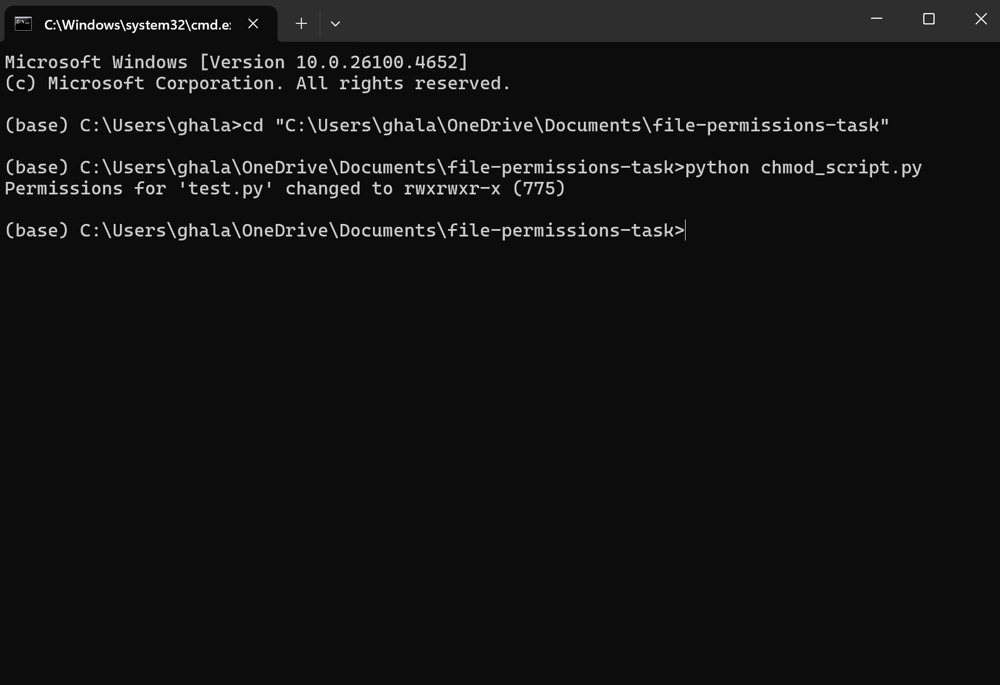

# File Permissions Task – Python chmod

This project demonstrates how to understand and apply Unix-style file permissions using Python.

## Objective

- Understand Linux file permissions (read, write, execute).
- Visualize the permission system in a simple flowchart.
- Use Python to apply the `chmod` command and set file permissions to `rwxrwxr-x` (775).

## Explanation

Linux file permissions are represented in three groups:

| User Type | Permissions | Value |
|-----------|-------------|-------|
| User      | `rwx`       | 7     |
| Group     | `rwx`       | 7     |
| Others    | `r-x`       | 5     |

This corresponds to a **775** permission mode.

## Python Script

The script uses Python's built-in `os.chmod()` method to change the permissions of a test file:

```python
import os

file_path = "test.py"
os.chmod(file_path, 0o775)
print(f"Permissions for '{file_path}' changed to rwxrwxr-x (775)")
````
## Files Included

| File Name                  | Description |
|----------------------------|-------------|
| `chmod_script.py`          | Python script to apply `chmod 775` on a file. |
| `test.py`                  | A dummy file used to test the permission change. |
| `permissions_flowchart.png`| A visual flowchart explaining permission breakdown. |
| `README.md`                | Project overview and explanation. |
| `execution_screenshot.png` | Screenshot showing the output of the script. |


## Output Example
When the script is run, you should see this in your terminal:
```python
Permissions for 'test.py' changed to rwxrwxr-x (775)
````
## Screenshot
Below is a screenshot showing the successful execution of the Python script:

 
